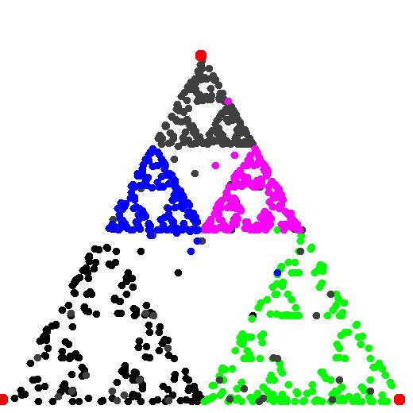

# chaos-p2p
This is a pure, no framework Java implementation of the **peer to peer** [Chaos Game](https://en.wikipedia.org/wiki/Chaos_game). Below is the image generated by 5 machines:  

 
For more details read [docs-srb](https://github.com/pvodopija/chaos-p2p/blob/master/chaos/chaosP2P-dokumentacija.pdf).
